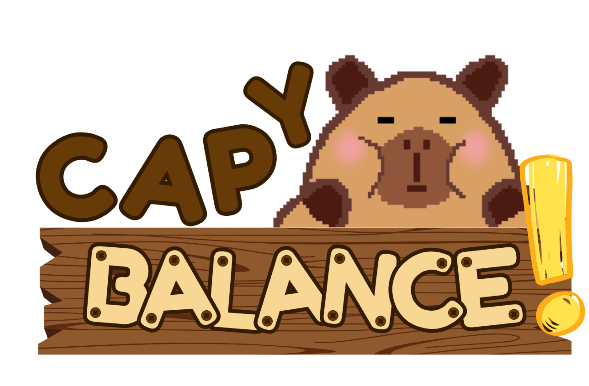

# capybalance-stacking-game
Introduction to Game Development Final Project

Capybalance! is a capybara stacking mobile game developed on Godot 4.4.1 developed by Romero, Hsisan Angel, del Rosario, Ann Marielle, and Ocampo, Glen Jarine as part of their final requirements for COSC 106: Introduction to Game Development. 

This is the first completed version of the project, released on June 15, 2025.
